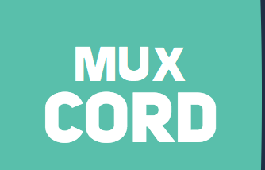
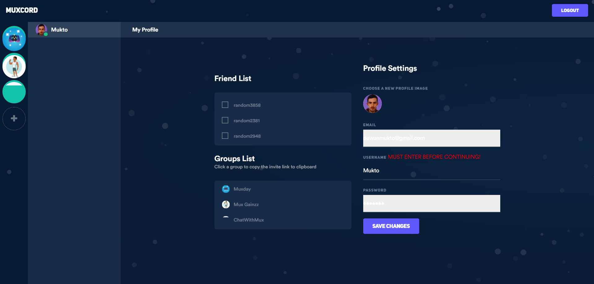

# MuxCord
<p align="center">
   </br>
  A "Discord clone" with Socket.io, Node.js &amp; MongoDB... 
</p>




# :floppy_disk: Installation

```bash
# clone the repo
$ git clone https://github.com/ThalKod/discord-clone.git

$ cd discord-clone

# install the node modules...
$ npm install

# start
$ npm start
```
Make sure you start mongodb or correct env var...
```js
config.dbURL = process.env.DATABASEURL || "mongodb://localhost/minicord";
```


## Built with

* [Socket io](https://github.com/socketio/socket.io) - Realtime application framework
* [Nodejs](https://github.com/nodejs/node) - Node.js JavaScript runtime

## Upcomming Features
- [ ] Friends Request, sending/add people to friends list...
- [ ] Real time one to one chat with friends...
- [ ] Direct message friends...
- [ ] Received Message Notifications...
- [ ] Emoji Sharing...
- [ ] Image Sharing within chat...
- [ ] Files Upload and sharing...

This is a clone of [ThalKod's repository](https://github.com/ThalKod/discord-clone). This repository may NOT contain all the code and files used in the production build [here](https://muxcord.apps.muxworks.com/).
